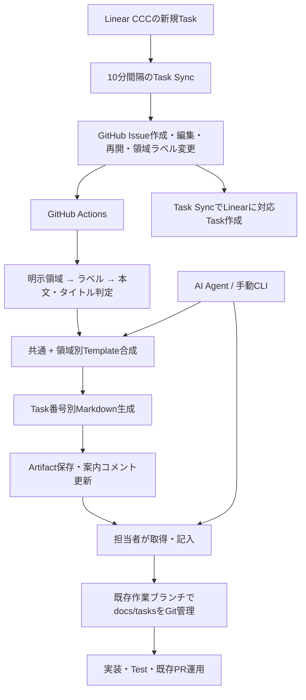

# 開発準備の自動化

## 追加実装：Linear ↔ GitHubのTask作成

CCCチームの新規TaskとGitHub Issueを相互作成するActionsを追加しました。[設定・動作・復旧手順](task-sync.md) を参照してください。GitHubは作成イベント、Linearは10分間隔の取得で同期します。稼働にはLinear APIキー、CCCチームUUID、固定開始日時、有効化変数の設定が必要です。

追加ファイルは `.github/workflows/task-sync.yml`、`scripts/task-sync/{linear,sync,run}.cjs`、`scripts/task-sync/sync.test.cjs`、`docs/automation/task-sync.md`。既存Task Preparationは同期処理と競合しないよう直列化し、検証CIに同期テストを追加しました。以下の分析は初期導入時の記録です。

## A. Repository分析（2026-09-08）

| 対象 | 確認結果 |
| --- | --- |
| Web | `main/web`、Next.js 15／React 19、App Router、features/shared、Clerk、Prisma/PostgreSQL、pnpm |
| AI Server | `main/ai/features/inference` のmain/config/image_processor/predictorはdocstringのみ。推論APIはまだ実装されていない |
| IoT | `main/iot/.gitkeep` のみ。機種・Firmwareはコードから確定できない |
| 設計資料 | `docs/component-design.md`、`main/docs/architecture.md`、各README。`docs/basicDesign.md` と `docs/detailed-design.md` は未追跡の空ファイルであり保持 |
| CI/CD | push時のWeb lint/build、AI/IoT Ruff。確認したworkflowにdeploy処理なし |
| 開発ルール | READMEのfeature領域別ブランチ、dev統合、mainはPR＋１レビュー。既存PRテンプレートあり。CONTRIBUTING、AGENTS.md、Issue Template、独立Test Planは調査範囲ではなし |
| GitHub | originは `CCCproject2026/ccc_project_2026`。既存Issueを読み取り確認。設定画面のActions制限・ブランチ保護は未確認 |
| Linear | Issue本文に移行元識別子・URL・Priority・親Issueあり。Repository内にAPI/Webhook設定は見つからず、現在の同期設定は未確認 |

確認例: [#138](https://github.com/CCCproject2026/ccc_project_2026/issues/138) はCCC-112から移行した「Next.jsでSSEを受信」、[#155](https://github.com/CCCproject2026/ccc_project_2026/issues/155) はCCC-95から移行したスタッフAPI。移行の痕跡は現在の双方向同期を意味しません。

問題点はTask単位の設計・作業計画の書式と準備自動化がないこと。READMEのRaspberry Pi／Socket.io、Component DesignのESP32、IssueのSSE、旧DBモデル名と現行schemaの差異があります。今回アーキテクチャを決め直さず、未決事項として担当者が照合できる書式にします。

## B・C. Template構成・一覧

[Template一覧](../templates/README.md) を参照。共通４ファイル＋領域別の追加項目９ファイルで重複を避けます。設計内容や担当・優先度を自動補完せず、見出し・短い記入コメント・空の表だけを用意します。

## D・E. WorkflowとAutomation Architecture



初期版での自動処理はArtifactと案内コメントまで。ブランチ・commit・PRは担当者の既存運用に従います。アプリコードの変更や設計の決定は行いません。

判定順序は `Development area` → `area:web` / `area:ai-server` / `area:iot` / `area:common` → キーワード。ラベルは任意で、必要な場合だけ既存運用に合わせて作成してください。複数ラベル・複数領域ヒット・不明はcommon、Other指定もcommonです。自由文の判定は限定的な補助であり、判定理由を表示します。LLMは使いません。

| 候補 | 採用判断 |
| --- | --- |
| GitHub Issue Form + Actions + API | 既存GitHub/CIを利用。追加サービス・APIキー不要のため採用 |
| Repository内CLI | GitHub／Linear／Agentが同じ書式を生成でき、オフラインでも使えるため採用 |
| Linear API / Webhook | Task Sync ActionsでAPIによる相互作成を追加。Webhookサーバーは設置せず定期取得 |
| LLMによる領域判定 | 明示選択で足りるため未導入。将来は候補提案のみとし、曖昧な場合は人が確認 |
| 自動branch / PR | 書込権限と再実行時の競合管理が増えるため初期版では不要 |

## F. 追加・変更ファイル

- `docs/templates/common/{basic-design,detailed-design,implementation-plan,test-plan}.md`
- `docs/templates/{web,ai-server,iot}/{basic-design,detailed-design,implementation-plan}.md`
- `docs/templates/{README,task}.md`
- `docs/development/workflow.md`、`docs/automation/README.md`
- `scripts/task-prep/{prepare,comment,prepare.test}.cjs`
- `.github/ISSUE_TEMPLATE/development-task.yml`
- `.github/workflows/task-preparation.yml`、`task-preparation-check.yml`
- ルート `README.md` は入口リンクのみ追記。既存のアプリ実装、schema、設計資料、CI、PRテンプレートはそのまま利用。

## G. 実装順序・導入

1. Repository／既存Issueを調査し、資料と実装の差を記録。
2. 空の共通・領域別TemplateとIssue Formを追加。
3. 領域判定・合成・上書き防止CLIを追加。
4. Artifact保存と単一のbotコメント更新をActionsに接続。
5. 担当者手順とローカル自動テストを追加。
6. 通常のPRレビュー後、GitHubのデフォルトブランチに導入。Issueイベントworkflowはデフォルトブランチへの配置が必要。
7. Actionsが許可され、`contents: read` と `issues: write` が使えることを確認。テンプレート準備単体はAPIキー不要。双方向作成には [Task Syncの設定](task-sync.md) を追加。
8. Web、AI Server、IoT、OtherのIssueを作成して生成物・コメントを確認。編集で案内コメントが更新され、記入済みローカルファイルが維持されることを確認。

現時点の変更はローカル実装です。リモートへのpush、実際のIssueへのコメント、GitHub設定変更、Linearへの書込みは行っていません。GitHub上の受入確認は導入後に必要です。

## H. リスク・復旧

| リスク | 対応 |
| --- | --- |
| 誤判定・領域横断 | 明示選択を優先。不明時は共通書式、複数領域は必要項目を追記 |
| 再実行で設計が消える | ローカルは既存フォルダに上書きしない。Actionsは実行ごとのArtifact |
| コメント重複 | Task自動化共通のconcurrency、ページング取得、bot専用マーカーで既存コメントを更新 |
| Issue本文の不正な指示 | 本文をシェル・パス・設計内容に埋め込まず、領域判定のデータとしてのみ扱う |
| 権限不足・Actions停止 | 実行ログを確認。同じCLIで準備を継続 |
| Artifact期限・取得権限 | 30日以内に取得してGit管理。期限切れならCLIで再生成 |
| 更新頻度・古い実行結果 | 最新実行のArtifactを利用。コメントは最新Issueで再判定。実行履歴の失敗を確認 |
| Linearとの二重管理 | 専用マーカーと相互リンクで対応を追跡。設定後は新規Taskを相互作成。編集・状態同期は対象外 |

停止時はGitHubでTask Preparation workflowを無効化します。ローカルCLIと既存の設計ファイルは継続利用できます。

## 検証

```bash
node --test scripts/task-prep/*.test.cjs scripts/task-sync/*.test.cjs
```

明示選択・推定・曖昧判定、全領域の生成、危険なID拒否、記入済みファイル保護、コメント作成／更新を検証します。GitHub APIのテストはモックであり、実サービスでの権限確認を代替しません。

仕様参照: [Issue Forms](https://docs.github.com/en/communities/using-templates-to-encourage-useful-issues-and-pull-requests/syntax-for-issue-forms)、[Issueイベント](https://docs.github.com/en/actions/reference/workflows-and-actions/events-that-trigger-workflows#issues)、[Actions権限](https://docs.github.com/en/actions/reference/workflows-and-actions/workflow-syntax#permissions)。
