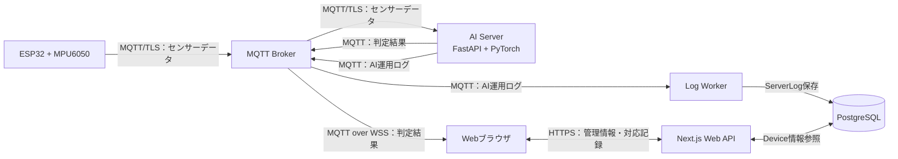

# Basic Design — AI Server基本設計

## Task情報

| 項目          | 内容                                                            |
| ------------- | --------------------------------------------------------------- |
| Issue URL     | https://github.com/CCCproject2026/ccc_project_2026/issues/166   |
| Task名        | 転倒検知支援システムのAI Server基本設計                         |
| 領域          | AI Server・推論・MQTT連携                                       |
| 関連設計      | システム全体基本設計、Webシステム基本設計、データベース基本設計 |
| 実行環境      | EC2 #2：AI Server                                               |
| API Framework | FastAPI                                                         |
| 推論Framework | PyTorch                                                         |

---

## 1. 対象範囲・前提

### 1.1 対象範囲

- IoTデバイスからのセンサーデータ受信
- デバイス識別とデバイス情報の参照
- デバイスごとのBuffer管理
- Window生成とStandardScalerによる前処理
- 1D-CNNによる転倒推論
- MQTT Brokerへの判定結果送信
- MQTT BrokerへのAI運用ログ送信
- AI Serverとデバイス間の接続状態管理

### 1.2 前提

- 最終デモではESP32＋MPU6050を1台使用する。
- 今回の動作確認・性能確認は1台構成を対象とする。
- 複数デバイスからの同時接続・データ送信は将来対応とする。
- デバイス名・デバイスコードなどの管理情報はWeb側で登録し、Databaseで管理する。
- AI ServerはPostgreSQLへ直接接続しない。
- AI Serverが必要とするDevice情報は、Web APIを経由して参照する。
- 転倒判定結果の画面表示、対象高齢者の特定、アラート状態、対応操作、アラーム音はWeb側が担当する。
- AI判定結果の自動履歴はDatabaseへ保存しない。

本書の「実装済み・未実装」は、実装状況確認時に別途区分する。本書では採用する設計方針を定義する。

---

## 2. システム構成・責務



| コンポーネント  | 責務                                                             |
| --------------- | ---------------------------------------------------------------- |
| ESP32＋MPU6050  | 6軸センサーデータをMQTTで送信する                                |
| MQTT Broker     | センサーデータ、判定結果、AI運用ログを配信する                   |
| AI Server       | センサーデータを受信し、デバイスごとに推論して判定結果を送信する |
| Next.js Web API | Device情報を保持・提供し、Web画面の管理操作を処理する            |
| Webブラウザ     | 判定結果を受信し、デバイス割当から高齢者を特定して表示する       |
| Log Worker      | AI運用ログを受信し、ServerLogへ保存する                          |
| PostgreSQL      | Device等の管理情報とServerLogを保存する                          |

### 2.1 通信方式

| 接続                      | 方式          | 内容                 |
| ------------------------- | ------------- | -------------------- |
| ESP32 → MQTT Broker       | MQTT/TLS      | センサーデータ       |
| MQTT Broker → AI Server   | MQTT/TLS      | センサーデータ購読   |
| AI Server → MQTT Broker   | MQTT/TLS      | 判定結果、AI運用ログ |
| MQTT Broker → Webブラウザ | MQTT over WSS | 判定結果             |
| AI Server → Web API       | HTTPS         | Device情報の読み取り |
| Log Worker → PostgreSQL   | DB接続        | ServerLog保存        |

センサーデータをAI Serverへ直接WebSocket送信する方式は本設計では採用しない。MQTT Brokerを経由し、接続認証・Topicアクセス制御はインフラ設計で定義する。

---

## 3. 推論構成・責務

### 3.1 推論処理

1. AI ServerがセンサーデータTopicを購読する。
2. 受信メッセージからデバイスコードを取得する。
3. Device情報を確認し、対象デバイスが有効か判定する。
4. デバイスごとのBufferへ6軸データを追加する。
5. BufferからWindowを生成する。
6. StandardScalerで前処理する。
7. 1D-CNNへ入力し、推論結果を取得する。
8. 転倒判定の場合、判定結果を判定結果Topicへ送信する。
9. 処理状況・エラーを運用ログTopicへ送信する。

### 3.2 デバイス識別

- AI Serverが受信する外部識別子はDevice.deviceCodeと対応付ける。
- Deviceの内部IDや高齢者IDをAI Serverから判定結果に含めない。
- Device情報はWeb APIから読み取り、AI Server内に必要な範囲でキャッシュできる。
- Web APIから取得したDeviceのstatusが`ACTIVE`以外の場合、推論対象から除外する。
- デバイスコードが未登録の場合は転倒として扱わず、エラーまたは警告ログを出力する。
- デバイスコードの変更・割当変更はWeb側で行う。AI ServerはDevice情報を変更しない。

### 3.3 デバイスごとの処理分離

各デバイスについて、次の状態を独立して管理する。

- MQTT接続・受信状態
- 最新受信時刻
- センサーデータBuffer
- Window生成位置
- 推論処理状態
- 最後に送信した判定結果

1台構成で動作させるが、デバイス単位の状態分離を維持し、将来の複数デバイス対応を妨げない構成とする。

### 3.4 AI Serverが担当しない処理

- DeviceAssignmentからの高齢者特定
- Web画面へのアラート表示
- 未対応アラートの保持
- スタッフの対応者決定
- 対応記録の保存
- アラーム音の制御
- 転倒判定結果のDatabase保存

---

## 4. 入力・前処理・出力フロー

```text
ESP32＋MPU6050
  ↓ MQTT/TLS：6軸センサーデータ
MQTT Broker
  ↓ MQTT/TLS：センサーデータTopic
AI Server（FastAPI）
  ↓ デバイス識別
DeviceごとのBuffer
  ↓
Window生成（100 samples／2秒）
  ↓
StandardScaler
  ↓
1D-CNN推論
  ↓ 転倒判定
MQTT Broker
  ↓ MQTT over WSS：判定結果Topic
Webブラウザ
  ↓ DeviceAssignment参照
対象Elder特定・Alert表示・アラーム
```

### 4.1 入力データ

- センサーデータは6軸とする。
- サンプリングレートは50Hzを基本とする。
- Windowサイズは100サンプル、約2秒とする。
- センサーデータの軸順、単位、タイムスタンプ形式、欠損時の処理はAI・IoT担当間で確定する。
- MQTTメッセージの正式なTopic名とJSON形式は、AI・IoT・インフラ担当で確定する。

### 4.2 BufferとWindow

- デバイスごとにBufferを持つ。
- Buffer上限を超えたデータは古いデータから破棄する。
- Windowは100サンプルで生成する。
- WindowのStepは未決とし、詳細設計で決定する。
- 欠損・順序逆転・異常なタイムスタンプのデータは、推論前に検証する。
- Window生成に必要なサンプルが不足している場合は推論しない。

### 4.3 前処理と推論

- StandardScalerを推論前に適用する。
- Scalerはモデルと対応するファイルとしてAI Serverで管理する。
- Scalerとモデルのバージョンが一致しない場合は推論を開始しない。
- 推論閾値は0.5を初期値とする。
- 推論結果は日常動作または転倒として扱う。
- 推論例外は転倒判定に変換せず、AI運用ログとして送信する。

### 4.4 出力

- 転倒判定結果はMQTT Brokerの判定結果Topicへ送信する。
- 日常動作の結果をWebへ送信するかは未決とする。
- Web側は受信したDeviceの識別子とDeviceAssignmentを使って対象Elderを特定する。
- DeviceAssignmentが存在しない場合、Web側は未登録・未割当として警告表示する。
- AI Serverは`elderId`を生成・送信しない。
- AI Serverは`deviceId`を含む判定結果を送信するが、ここでの識別子はDevice.deviceCodeなど、Topic仕様で合意した外部識別子とする。

---

## 5. MQTTメッセージ方針

正式なTopic名・認証・QoS・保持設定はインフラ設計および結合設計で確定する。本書ではデータの役割だけを定義する。

### 5.1 センサーデータ

```json
{
  "device_code": "ESP32-001",
  "measured_at": "2026-09-23T10:00:00.000Z",
  "accelerometer": {
    "x": 0.0,
    "y": 0.0,
    "z": 0.0
  },
  "gyroscope": {
    "x": 0.0,
    "y": 0.0,
    "z": 0.0
  }
}
```

### 5.2 判定結果

```json
{
  "device_code": "ESP32-001",
  "result": "fall",
  "detected_at": "2026-09-23T10:00:05.000Z",
  "model_version": "prototype-phase-1"
}
```

- `result`は`fall`を転倒、`normal`を日常動作とする。
- `detected_at`はAI Serverが判定した時刻をISO 8601形式で送信する。
- 時刻はUTCを基本とし、Web画面でJSTに変換する。
- `event_id`は現時点では必須としないが、重複配信を区別するため将来追加できる構造にする。
- `elder_id`は含めない。

### 5.3 AI運用ログ

AI Serverは判定結果とは別のTopicへ、起動・停止、受信状況、推論成功・失敗、処理時間、入力不正などを送信する。Log Workerが受信してServerLogへ保存する。

AI運用ログには、認証秘密情報や不要な個人情報を含めない。

---

## 6. Web連携

### 6.1 判定結果の連携

判定結果はAI ServerからWeb APIへHTTP POSTしない。AI ServerがMQTT Brokerへ送信し、Webブラウザが判定結果TopicをMQTT over WSSで購読する。

Web側の処理は次のとおりとする。

1. ブラウザが判定結果を受信する。
2. Web側がdevice_codeとDevice情報を照合する。
3. DeviceAssignmentから検知時点の対象Elderを特定する。
4. 未対応AlertがなければAlertを作成する。
5. 同じDeviceの未対応Alertがあれば同じAlertとして扱う。
6. Alert表示とアラーム音を開始・継続する。

### 6.2 アラート状態

- AI ServerはAlert状態を保持しない。
- 未対応Alert、対応開始、アラーム停止、対応記録保存はWeb側が管理する。
- 同じDeviceからの連続した`fall`は、Web側の未対応Alertが存在する間は同じAlertとする。
- Web側で対応開始後に新しい`fall`を受信した場合は、新しいAlertとする。
- 日常動作の判定結果で未対応Alertを自動解除しない。
- 同じ判定結果の再配信を新しいAlertと扱わない方式は、重複識別方法の確定後に実装する。

### 6.3 Device情報

- Deviceの登録・変更はWeb APIが担当する。
- AI ServerはWeb APIからDevice.deviceCode、statusなどの読み取り情報を取得する。
- DeviceAssignment、高齢者情報、対応記録はAI Serverへ共有しない。
- DeviceのONLINE/OFFLINEなど接続状態の通知方法は、AI・Web・インフラ担当で確定する。

### 6.4 API連携の扱い

旧設計で想定していたAI ServerからWeb APIへの`POST /api/alert`は採用しない。判定結果の配信経路はMQTTに統一する。

---

## 7. 接続状態・エラー処理

### 7.1 AI ServerとMQTT Brokerの接続

- Broker接続が切断した場合、AI Serverは再接続を試みる。
- 再接続時はセンサーデータTopicを再購読する。
- 再接続の待機時間、上限、QoS、保持メッセージの扱いはインフラ設計で確定する。
- 切断・再接続・購読失敗はAI運用ログへ送信する。

### 7.2 デバイスの接続状態

- AI Serverはデバイスごとの最新受信時刻を管理する。
- 一定時間データを受信しない場合にOFFLINEと判定する方式を基本とする。
- OFFLINE判定のタイムアウトは未決とする。
- 接続状態をWeb側へ通知するTopic、API、表示条件は未決とする。
- 接続切断を転倒判定として扱わない。

### 7.3 推論エラー

- モデル読込失敗、Scaler読込失敗、入力不正、推論例外は転倒として扱わない。
- 推論エラーはAI運用ログとして送信する。
- 推論継続が不可能な場合、AI Serverは判定結果を送信せず、状態を監視対象にする。

### 7.4 Webへの通知失敗

判定結果をMQTTへ送信できない場合は、AI Server側で送信失敗をAI運用ログへ記録する。HTTP APIの30秒間隔・無制限再送は採用しない。MQTTのQoS、保持、再接続、再送条件をインフラ設計で確定する。

---

## 8. Model・性能要件

### 8.1 Phase 1モデル

| 項目          | 内容                     |
| ------------- | ------------------------ |
| モデル        | 1D-CNN（PyTorch）        |
| Model version | Prototype Phase 1        |
| Model file    | `best_1dcnn_pytorch.pth` |
| 入力          | 6軸センサーデータ        |
| Sampling Rate | 50Hz                     |
| Window Size   | 100 samples（約2秒）     |
| Step          | 未決                     |
| 前処理        | StandardScaler           |
| 出力          | 日常動作（0）／転倒（1） |
| 推論閾値      | 0.5                      |

### 8.2 1D-CNN構成

- 第1層：Conv1d、6 → 32 channels、Kernel Size 3
- 第2層：Conv1d、32 → 64 channels、Kernel Size 3
- 第3層：Conv1d、64 → 128 channels、Kernel Size 3
- 各Convolution BlockにBatchNorm1dおよびReLUを配置する。
- 1・2層目のConvolution後にMaxPool1dを配置する。
- AdaptiveAvgPool1dにより時系列方向を長さ1へ集約する。
- 全結合層（128 → 64 → 1）により最終出力を得る。
- 全結合部にReLUおよびDropout（0.3）を使用する。

### 8.3 学習設定

学習設定はモデル作成時の記録として扱い、AI Serverの推論設定と区別する。

- 損失関数：BCEWithLogitsLoss
- Optimizer：Adam
- Learning Rate：0.001
- Batch Size：64
- Epochs：最大50

### 8.4 実行環境

- Framework：PyTorch
- API Framework：FastAPI
- Python version：未決
- CPU：未決
- Memory：未決
- GPU：未決
- OS：未決

### 8.5 性能要件

- 対象デバイス数：1台
- センサーデータ受信周期：50Hz
- Windowサイズ：100 samples（約2秒）
- 推論処理単体の遅延目標：未決
- 正常な通信状態では、AIの転倒判定からWeb画面のAlert表示まで1秒以内を目標とする。
- 上記の1秒は、判定前のセンサーデータ収集・Window生成時間を含めない。
- センサー入力からWeb画面表示までの全体遅延上限：未決
- Memory使用量：未決
- CPU使用率：未決

### 8.6 精度評価条件

- 評価対象：日常動作・転倒
- 評価指標：Accuracy、Precision、Recall、F1-score、Confusion Matrix
- Phase 1目標：日常動作・転倒それぞれの評価基準を定義した上で85%以上を目標とする。
- 「クラス別Accuracy」の定義と算出方法は別途確定する。
- 評価時はValidation Datasetを使用する。

---

## 9. セキュリティ・運用方針

- MQTT接続にはTLSを使用する。
- AI ServerはBrokerの管理者資格情報をWebブラウザへ渡さない。
- AI ServerからPostgreSQLへ直接接続しない。
- Device情報取得APIの認証方式はインフラ・Web担当と確定する。
- モデル・ScalerファイルはAI Server上のアクセス制御された領域で管理する。
- AI運用ログに個人情報、認証情報、秘密鍵を出力しない。
- モデルファイルとScalerのバージョン対応を起動時に検証する。

---

## 10. 未決事項

- WindowのStep
- センサーデータの軸順、単位、欠損時の扱い
- MQTT Topic名、QoS、保持設定、メッセージ形式
- 使用するScalerファイルとモデルとの対応方法
- Python、CPU、Memory、GPU、OSなどの実行環境
- 推論処理単体および全体遅延の性能目標
- Device.deviceCodeと受信メッセージの対応方法
- Device情報取得APIの認証方式、取得頻度、キャッシュ失効条件
- 未登録Device、割当変更、遅延通知の扱い
- 日常動作の判定結果をWebへ送信するかどうか
- `detected_at`のタイムゾーン規約
- MQTT再接続・再送・重複配信の扱い
- 同じ判定結果の重複識別方法（event_idの採用時期を含む）
- Device接続状態のOFFLINE判定タイムアウト
- 接続状態をWebへ通知する方法とデータ形式
- バッテリー情報の取得・管理・表示
- クラス別精度目標の定義
- 各未決事項の担当者と決定期限

---

## 11. 変更履歴

| 版  | 日付       | 内容                                                                     |
| --- | ---------- | ------------------------------------------------------------------------ |
| 1.0 | 2026-09-23 | 全体設計、Web基本設計、DB基本・詳細設計に合わせたAI Server基本設計を作成 |
