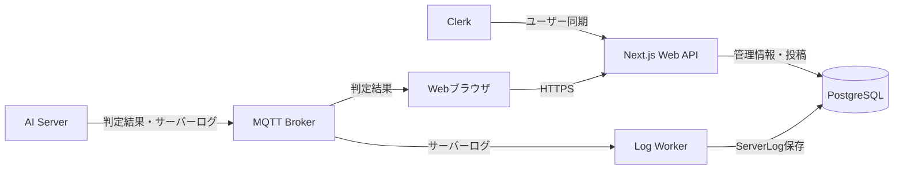
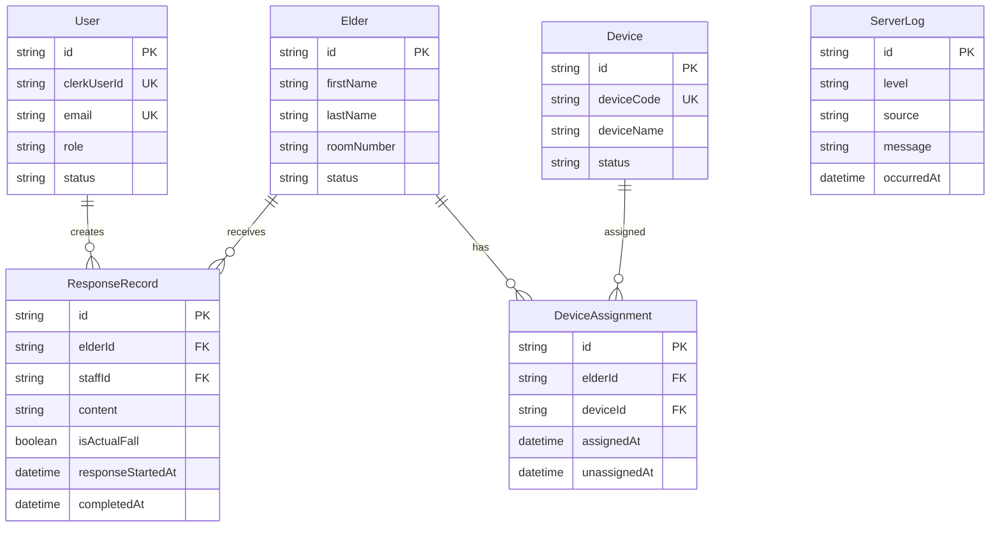

# Basic Design — データベース基本設計

## Task情報

| 項目      | 内容                                                          |
| --------- | ------------------------------------------------------------- |
| Issue URL | https://github.com/CCCproject2026/ccc_project_2026/issues/166 |
| Task名    | 転倒検知支援システムのデータベース基本設計                    |
| 領域      | Database                                                      |
| 担当者    | DB担当                                                        |
| 関連設計  | システム全体基本設計、Webシステム基本設計                     |
| DB        | PostgreSQL                                                    |
| ORM       | Prisma                                                        |
| 配置      | EC2 #1：Application Server                                    |

---

## 1. 目的・背景

Webシステムで使用するスタッフ、高齢者、デバイス、スタッフ投稿、サーバーログを保存する。

本設計では、次の情報をDBで管理する。

- スタッフの識別情報、ロール、利用状態
- 高齢者の基本情報、在籍状態
- IoTデバイスの識別情報、状態
- 高齢者とデバイスの現在の割当および割当履歴
- スタッフが作成する対応記録
- AI Serverなどから受信するサーバーログ

AIの転倒判定結果はMQTT Brokerからブラウザへリアルタイム配信し、判定結果そのものはDBへ自動保存しない。

---

## 2. 対象範囲・対象外

### 2.1 対象範囲

- User（スタッフ）
- Elder（高齢者）
- Device（デバイス）
- DeviceAssignment（デバイス割当）
- ResponseRecord（対応記録）
- ServerLog（サーバーログ）
- テーブル間の関連、主キー、外部キー、一意性、無効化方針

### 2.2 対象外

- AI判定結果の自動的な履歴保存
- 未対応アラートの永続化（対応開始後、対応記録の保存前も含む）
- センサーの生データ保存
- MQTTの配信待ちメッセージの保存
- AIモデル、学習データ、推論処理の保存
- ServerLogの閲覧画面
- SQL、Prismaスキーマの詳細実装
- AWSの具体的な設定値

---

## 3. システム構成・責務



| コンポーネント  | DBとの関係                                                            |
| --------------- | --------------------------------------------------------------------- |
| Webブラウザ     | DBへ直接接続しない。Web APIを利用する                                 |
| Next.js Web API | User、Elder、Device、DeviceAssignment、ResponseRecordを保存・取得する |
| Clerk           | 認証情報を管理し、WebhookでUserの同期を要求する                       |
| AI Server       | DBへ直接接続しない。MQTT Brokerへ判定結果とサーバーログを送信する     |
| Log Worker      | MQTT BrokerからServerLogを受信し、DBへ保存する                        |
| PostgreSQL      | 業務情報、スタッフ投稿、サーバーログを保存する                        |

---

## 4. データ保存方針

### 4.1 保存するデータ

| データ                  | 保存方法                                 |
| ----------------------- | ---------------------------------------- |
| スタッフ情報            | Userへ保存する                           |
| 高齢者情報              | Elderへ保存する                          |
| デバイス情報            | Deviceへ保存する                         |
| デバイス割当            | DeviceAssignmentへ期間情報として保存する |
| 対応記録                | ResponseRecordへ保存する                 |
| AI Serverなどの運用ログ | ServerLogへ保存する                      |

### 4.2 保存しないデータ

AI Serverから送信される転倒判定結果は、ブラウザへリアルタイム配信するためのデータとして扱う。受信のたびに転倒履歴やアラートをDBへ作成しない。

対応記録は、スタッフが入力して保存した時点で作成する。AI判定結果を受信しただけではResponseRecordを作成しない。

対応状態はWebシステム基本設計と合わせて「未対応」「対応済み」の2種類とする。対応開始後も記録の保存が成功するまでは「未対応」とし、ResponseRecordの保存成功時に「対応済み」とする。保存に失敗した場合は「未対応」を維持する。

### 4.3 無効化と履歴保持

User、Elder、Deviceは物理削除せず、状態を変更して管理する。DeviceAssignmentは解除日時を記録し、過去の割当を削除しない。ResponseRecordは、スタッフまたは高齢者が無効化された後も参照できるようにする。

---

## 5. テーブル一覧

| テーブル         | 役割                               | 他テーブルとの関係                     |
| ---------------- | ---------------------------------- | -------------------------------------- |
| User             | スタッフの識別情報、権限、利用状態 | ResponseRecordと関連                   |
| Elder            | 高齢者の基本情報、在籍状態         | DeviceAssignment、ResponseRecordと関連 |
| Device           | IoTデバイスの識別情報、状態        | DeviceAssignmentと関連                 |
| DeviceAssignment | 高齢者とデバイスの割当期間・履歴   | Elder、Deviceと関連                    |
| ResponseRecord   | スタッフが作成する対応記録         | User、Elderと関連                      |
| ServerLog        | AI Serverなどの運用ログ            | 他テーブルとは関連しない               |

---

## 6. ER図



ServerLogは業務データと連携しない独立テーブルとする。ResponseRecordにはdeviceIdを持たせない。スタッフが残す情報の対象はデバイスではなく、対応対象となったElderだからである。

---

## 7. 各テーブルの基本設計

### 7.1 User（スタッフ）

看護師・介護士など、Webシステムを利用するスタッフを管理する。

| 項目          | 内容                                         |
| ------------- | -------------------------------------------- |
| `id`          | スタッフの内部ID。主キー                     |
| `clerkUserId` | ClerkのユーザーID。一意。Clerk登録前はNULL可 |
| `firstName`   | 名                                           |
| `lastName`    | 姓                                           |
| `email`       | メールアドレス。一意                         |
| `role`        | `CAREGIVER` または `NURSE`                   |
| `startDate`   | 利用開始日・入職日                           |
| `endDate`     | 利用終了日・退職日。NULL可                   |
| `dateOfBirth` | 生年月日                                     |
| `nationality` | 国籍                                         |
| `gender`      | 性別                                         |
| `status`      | `PENDING`、`ACTIVE`、`INACTIVE`              |
| `createdAt`   | 作成日時                                     |
| `updatedAt`   | 更新日時                                     |

- Clerkを認証情報の正とし、Userをロール・利用状態の正とする。
- Clerk Webhookを複数回受信しても、同じclerkUserIdのUserを重複作成しない。
- Clerk未登録の招待中スタッフは、clerkUserIdがNULLの状態を許可する。
- スタッフを無効化しても、過去のResponseRecordは削除しない。
- 最後の有効なNURSEの無効化・降格は禁止する。

### 7.2 Elder（高齢者）

施設で管理する高齢者を管理する。

| 項目          | 内容                       |
| ------------- | -------------------------- |
| `id`          | 高齢者の内部ID。主キー     |
| `firstName`   | 名                         |
| `lastName`    | 姓                         |
| `roomNumber`  | 部屋番号                   |
| `status`      | `ACTIVE` または `INACTIVE` |
| `dateOfBirth` | 生年月日                   |
| `gender`      | 性別                       |
| `createdAt`   | 作成日時                   |
| `updatedAt`   | 更新日時                   |

- 退所・ご逝去時はstatusをINACTIVEに変更する。
- INACTIVEになった後もResponseRecord、DeviceAssignmentを保持する。
- `age`はdateOfBirthから表示時に計算するため、保存しない。
- Elderの無効化と有効なDeviceAssignmentの終了は、同じ処理で実行する。

### 7.3 Device（デバイス）

Raspberry Piなど、センサーデータを送信するIoTデバイスを管理する。

| 項目         | 内容                                    |
| ------------ | --------------------------------------- |
| `id`         | デバイスの内部ID。主キー                |
| `deviceCode` | デバイス固有コード。MACアドレス等。一意 |
| `deviceName` | 画面表示用のデバイス名                  |
| `status`     | `ACTIVE`、`MAINTENANCE`、`INACTIVE`     |
| `createdAt`  | 登録日時                                |
| `updatedAt`  | 更新日時                                |

- deviceCodeは重複させない。
- Deviceの状態は、デバイス自体の利用状態を表す。
- 故障時はMAINTENANCEまたはINACTIVEへ変更し、物理削除しない。
- deviceCodeの変更は、現在有効なDeviceAssignmentがない場合だけ許可する。
- Deviceの故障・交換後も、過去のDeviceAssignmentは保持する。
- AIが判定するONLINE/OFFLINEと、DBで管理するstatusは別概念とする。接続状態の永続化は本設計の対象外とする。

### 7.4 DeviceAssignment（デバイス割当）

ElderとDeviceの割当を管理する。現在の割当だけでなく、付け替えや解除の履歴も保存する。

| 項目           | 内容                               |
| -------------- | ---------------------------------- |
| `id`           | 割当の内部ID。主キー               |
| `elderId`      | ElderのID。外部キー                |
| `deviceId`     | DeviceのID。外部キー               |
| `assignedAt`   | 割当開始日時                       |
| `unassignedAt` | 割当解除日時。現在有効な場合はNULL |
| `createdAt`    | 作成日時                           |
| `updatedAt`    | 更新日時                           |

- 高齢者1人に対して、現在有効なデバイスは1台までとする。
- デバイス1台に対して、現在有効な高齢者は1人までとする。
- 割当の変更は、旧割当の終了と新割当の作成を1トランザクションで処理する。
- 割当解除後もレコードを削除しない。
- 割当期間は重複させない。
- 現在有効な割当はunassignedAtがNULLのレコードとする。
- 遅延して届いた通知の対象は、通知に含まれる検知時刻と割当期間で特定する。

### 7.5 ResponseRecord（対応記録）

スタッフが高齢者への現場対応を完了した後に作成する対応記録を管理する。

| 項目                | 内容                         |
| ------------------- | ---------------------------- |
| `id`                | 対応記録の内部ID。主キー     |
| `elderId`           | 対応対象のElder ID。外部キー |
| `staffId`           | 対応したUser ID。外部キー    |
| `content`           | 対応内容・メモ               |
| `isActualFall`      | 実際の転倒だったか。必須     |
| `responseStartedAt` | 対応開始日時                 |
| `completedAt`       | 記録完了日時                 |
| `createdAt`         | 作成日時                     |
| `updatedAt`         | 更新日時                     |

- elderId、staffId、content、isActualFallを必須とする。
- staffIdはログイン中のUserからサーバー側で設定する。
- 転倒通知のdeviceIdは保存しない。
- 対応記録はスタッフの保存操作で作成し、AI判定受信だけでは作成しない。
- 未対応アラートの一時状態を保存するテーブルではない。保存された対応記録は「対応済み」を表し、対応状態のカラムは持たせない。
- responseStartedAtは対応開始日時を記録する項目であり、対応状態は増やさない。
- isActualFallがfalseの場合は誤検知として扱う。誤検知は対応状態とは別に管理し、記録保存後は「対応済み」とする。
- 対応記録はElderの詳細画面および対応記録一覧から取得できる。
- 対応記録の訂正・削除ルールは詳細設計で定義する。

### 7.6 ServerLog（サーバーログ）

AI Server、Log Workerなどの運用ログを保存する。業務データの状態や投稿者とは関連付けない。

| 項目         | 内容                                    |
| ------------ | --------------------------------------- |
| `id`         | ログの内部ID。主キー                    |
| `level`      | `DEBUG`、`INFO`、`WARN`、`ERROR`        |
| `source`     | ログ発生元。AI Server、Log Workerなど   |
| `message`    | ログメッセージ                          |
| `occurredAt` | ログが発生した日時                      |
| `receivedAt` | Log Workerが受信した日時                |
| `payload`    | 受信したログの追加情報。JSONB等で保存可 |
| `createdAt`  | DB保存日時                              |

- ServerLogはUser、Elder、Device、DeviceAssignment、ResponseRecordと外部キーで連携しない。
- 未登録デバイスやAI Server自身に関するログも保存できる。
- AI運用ログの保存を目的とし、転倒判定結果の履歴には使用しない。
- ログの保存期間、重複判定、保存失敗時の再試行は運用設計で定義する。
- ServerLogの閲覧画面は本システムの対象外とする。

---

## 8. リレーションと制約

### 8.1 リレーション

```text
User 1 ─── 多 ResponseRecord
Elder 1 ─── 多 DeviceAssignment
Device 1 ─── 多 DeviceAssignment
Elder 1 ─── 多 ResponseRecord
ServerLog ─── 独立
```

### 8.2 主な制約

- 全テーブルは内部IDを主キーとする。
- User.clerkUserId、User.email、Device.deviceCodeは一意とする。
- 現在有効なDeviceAssignmentは、1つのElderまたはDeviceにつき1件までとする。
- 外部キーを持つ履歴データは、UserやElderの無効化によって連鎖削除しない。
- 物理削除は原則として行わない。
- 割当変更はトランザクションで処理する。
- ServerLogは業務テーブルと外部キーで結ばない。

### 8.3 正規化

本設計は、各テーブルの属性を主キーに直接依存させる第3正規形（3NF）を目標とする。

- Elderの年齢は生年月日から算出し、重複保存しない。
- DeviceAssignmentを分離し、ElderとDeviceの割当履歴を独立して管理する。
- ResponseRecordは対応記録専用とする。
- ServerLogは業務データと独立したログテーブルとする。

---

## 9. 保存・取得の責任分担

| 操作                         | 担当                                 |
| ---------------------------- | ------------------------------------ |
| Userの同期                   | Clerk Webhookを受けるNext.js Web API |
| Userのロール・状態変更       | Next.js Web API                      |
| Elderの登録・更新・無効化    | Next.js Web API                      |
| Deviceの登録・更新・無効化   | Next.js Web API                      |
| DeviceAssignmentの作成・終了 | Next.js Web API                      |
| ResponseRecordの保存・取得   | Next.js Web API                      |
| ServerLogの保存              | Log Worker                           |
| AI判定結果の配信             | MQTT BrokerからWebブラウザ           |

AI ServerとWebブラウザはPostgreSQLへ直接接続しない。

---

## 10. 非機能方針

- PostgreSQLはインターネットへ直接公開しない。
- DB接続情報はサーバー側の環境変数等で管理する。
- Web APIとLog Workerには必要最小限のDB権限を付与する。
- 保存日時はUTCを基準とし、画面ではJSTへ変換して表示する。
- 投稿一覧はページ単位で取得する。
- 高齢者別の投稿、現在のデバイス割当、デバイスコード、日時による検索を考慮してインデックスを設計する。
- バックアップ、保存期間、復旧手順はインフラ設計で定義する。

---

## 11. 未決事項

| 事項                                   | 確認先               | 決定時期         |
| -------------------------------------- | -------------------- | ---------------- |
| 対応記録の訂正・削除ルール             | Web・DB担当          | 詳細設計前       |
| ServerLogの保存期間                    | DB・インフラ担当     | 運用設計時       |
| ServerLogの重複識別方法                | AI・DB・インフラ担当 | Log Worker実装前 |
| ServerLog保存失敗時の再試行方法        | DB・インフラ担当     | 結合試験前       |
| Userの招待中データを作成するタイミング | Web・Clerk担当       | Clerk連携実装前  |
| DeviceAssignmentの同時割当を防ぐDB制約 | DB担当               | Prisma詳細設計時 |
| 投稿とログの保存期間・バックアップ方針 | DB・インフラ担当     | 運用開始前       |

---

## 12. 変更履歴

| 版  | 日付       | 内容                               |
| --- | ---------- | ---------------------------------- |
| 1.2 | 2026-09-23 | ResponseRecordを対応記録専用に変更 |
