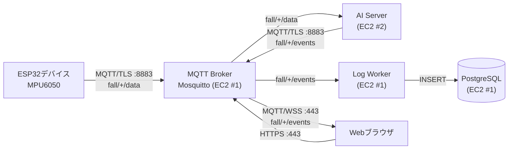
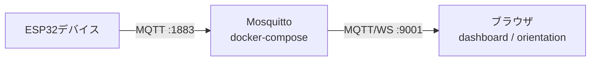

# MQTT Broker 設計 — MQTTブローカー設計

## Task情報・関連設計

| 項目 | 内容 |
| ---- | ---- |
| Task名 | MQTTブローカーの導入とAWS構成設計 |
| 領域 | インフラ／IoT／AI |
| 関連設計 | [全体基本設計](../basic_design/overview.md) |
| 関連Issue | #126 |
| 実装 | `docker-compose.yml`（`mqtt-broker` サービス）・ `main/broker/mosquitto.conf` |

---

## 1. 目的・背景

ESP32センサーデバイスが送信する生データをAI Serverで解析し、転倒判定結果を
Webブラウザへリアルタイムに配信するため、MQTTブローカーを中継点として導入する。

ブローカーは **EC2 #1**（Web + PostgreSQL + Log Worker と同一インスタンス）に配置し、
AI Server（EC2 #2）とは独立させる。これにより、AI処理が停止しても
デバイス↔ブローカー間のデータ収集は継続できる。

---

## 2. 全体構成



### 2.1 ローカル開発構成



ローカルでは `docker-compose.yml` の `mqtt-broker` サービスとして起動する。
設定ファイルは `main/broker/mosquitto.conf` を読み取り専用でマウントする。

---

## 3. 通信方式・プロトコル

| 項目 | ローカル開発 | AWS本番 |
| ---- | ------------ | ------- |
| MQTT/TCP | `1883` | `8883`（TLS） |
| MQTT/WebSocket | `9001` | `443`（WSS / TLS） |
| 認証 | 匿名（`allow_anonymous true`） | パスワード + ACL |
| QoS | 0 | 1（転倒イベントは永続化） |
| 永続化 | あり（`mqtt_data` ボリューム） | あり（EBS） |

### 3.1 セキュリティ

- **ローカル**: 匿名認証。信頼できるLAN内でのみ使用。
- **本番**: TLS（`8883`）+ パスワード認証 + ACLファイルで
  `fall/<device_id>/#` への publish をデバイス単位に制限する。
- ブラウザ向けは WSS（`443`）を使用し、平文WebSocketは公開しない。

---

## 4. Topic設計

| Topic | 方向 | QoS | 保持 | 説明 |
| ----- | ---- | --- | ---- | ---- |
| `fall/<device_id>/data` | デバイス → AI | 0 | なし | 生センサーデータ（2秒・100サンプル） |
| `fall/<device_id>/events` | AI → Worker/ブラウザ | 1 | あり | 転倒判定結果・信頼度 |
| `fall/<device_id>/status` | デバイス → 全体 | 1 | あり | オンライン／オフライン（LWT） |

- AI Server は `fall/+/data` をワイルドカード購読する。
- Log Worker は `fall/+/events` を購読し、PostgreSQL の `FallLog` に書き込む。
- ブラウザは `fall/+/events` を WSS で購読し、リアルタイム表示する。

---

## 5. データ形式

### 5.1 センサーデータ（`fall/<device_id>/data`）

```json
{
  "device_id": "esp32-mpu6050-01",
  "ts": "2026-09-30T12:00:00.000",
  "ts_ms": 1789700000000,
  "boot_ms": 12345,
  "tz_offset_sec": 32400,
  "samples": [
    { "t": 0, "ax": 0.01, "ay": 0.02, "az": 1.00, "gx": 0.1, "gy": 0.2, "gz": 0.3 }
  ]
}
```

- `samples` は最大100件（2秒分・50Hz）。
- 加速度は **g**、角速度は **deg/s**。
- `ts` はデバイスのNTP同期済み絶対時刻（JST, UTC+9）。

### 5.2 判定結果（`fall/<device_id>/events`）

```json
{
  "device_id": "esp32-mpu6050-01",
  "ts": "2026-09-30T12:00:02.000",
  "is_fall": true,
  "confidence": 0.93,
  "model_version": "cnn-v1"
}
```

---

## 6. 設定ファイル

`main/broker/mosquitto.conf`:

```conf
listener 1883 0.0.0.0
allow_anonymous true
listener 9001 0.0.0.0
protocol websockets
persistence true
persistence_location /mosquitto/data/
log_dest stdout
```

- 設定は **bind mount（読み取り専用）** でコンテナに渡す。
- データ永続化は **named volume** を使う。
  （ホストの bind mount だと root 所有ディレクトリが作られ、
  mosquitto が起動しない既知の問題があるため。）

---

## 7. AWSデプロイ

### 7.1 ネットワーク

| 項目 | 値 |
| ---- | -- |
| VPC | 既存VPC |
| サブネット | パブリックサブネット（EC2 #1） |
| セキュリティグループ | `8883`（MQTT/TLS）, `443`（WSS/HTTPS）, `22`（SSH）を許可 |
| Elastic IP | EC2 #1 に固定IPを割り当て（デバイスのブローカー接続先） |

### 7.2 デプロイ手順

1. EC2 #1 に Docker / docker-compose をインストール。
2. `main/broker/mosquitto.conf` を本番用に修正（TLS + 認証）。
3. `docker compose up -d mqtt-broker` で起動。
4. デバイスの `MQTT_HOST` を Elastic IP に変更。

### 7.3 バックアップ

- `mqtt_data` ボリューム（EBS）は定期的にスナップショットを取得。
- 判定結果は PostgreSQL 側でも永続化されるため、
  ブローカーのデータ損失は検知不能にはならない。

---

## 8. 運用・ログ

- ブローカーログは `log_dest stdout` で Docker ログに出力。
- `docker compose logs mqtt-broker` で確認。
- 接続クライアント数・メッセージレートは `$SYS/broker/#` で監視可能。

---

## 9. 未決事項・備考

- [ ] 本番用のTLS証明書（ACM or Let's Encrypt）の取得方法
- [ ] パスワード/ACLファイルの管理方法（Secrets Manager推奨）
- [ ] デバイス認証をパスワードからクライアント証明書へ変更するか
- [ ] ブローカーの冗長化（Single EC2 の SPOF 対策）
- [ ] ローカル設定（匿名）を本番へ持ち込まないこと
