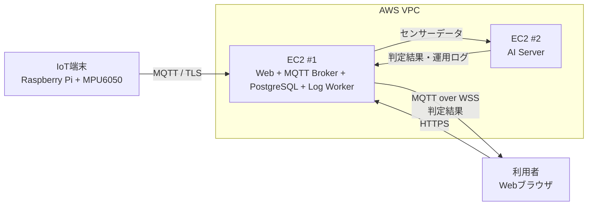

# Basic Design — システム全体基本設計

## Task情報

| 項目     | 内容                                     |
| -------- | ---------------------------------------- |
| Task名   | IoT 転倒検知システムの全体設計           |
| 領域     | IoT／AI／Web／インフラ／DB               |
| 担当者   | 各システム担当者                         |
| 関連設計 | 本書をもとに各担当者が作成する基本設計書 |

---

## 1. 目的・背景

IoT端末から取得したセンサーデータをAI Serverで分析し、転倒の可能性を判定する。

判定結果はMQTT Brokerを経由して利用者のWebブラウザへリアルタイムに通知する。

また、AI Serverが正常に動作しているかを確認できるように、稼働状況や処理エラーなどのAI運用ログをDBに保存し、database にそのまま保存する。
本システムでは、Web Server、MQTT Broker、PostgreSQL、ログ保存Workerを1台のEC2に集約し、AI処理を別のEC2に分離する。

本書では、システム全体の構成、各システムの役割、データの流れ、通信方式を定義する。

具体的な仕様は、各担当者が個別の基本設計書で定義する。

---

## 2. 対象範囲・対象外

### 2.1 対象範囲

- システム全体の構成と各コンポーネントの役割
- IoT端末からAI Serverまでのセンサーデータの流れ
- AI Serverからブラウザまでの判定結果の流れ
- AI運用ログの生成・送信・保存・確認の流れ
- システム間の通信方式
- AWS上のEC2構成
- 各担当者の設計範囲

### 2.2 対象外

- 転倒判定結果の履歴保存
- APIの詳細仕様
- MQTT Topicの詳細仕様
- データ形式の詳細仕様
- DBテーブルの詳細設計
- AIモデルの詳細
- AIの前処理・判定ロジックの詳細
- AWSの具体的な設定値
- ポート番号・認証情報などの詳細設定
- Web画面の詳細設計

---

## 3. システム構成・コンポーネント責務

### 3.1 全体構成

