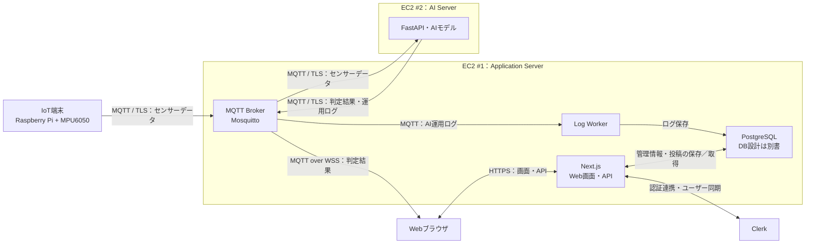

# Basic Design — Webシステム基本設計

## Task情報

| 項目      | 内容                                                                                                                                    |
| --------- | --------------------------------------------------------------------------------------------------------------------------------------- |
| Issue URL | https://github.com/CCCproject2026/ccc_project_2026/issues/166                                                                           |
| Task名    | 転倒検知支援Webシステムの基本設計                                                                                                       |
| 領域      | Web画面・API・リアルタイム受信・Log Worker                                                                                              |
| 担当者    | Kyi Pyar Hlaing                                                                                                                         |
| 関連設計  | [システム全体設計 #172](https://github.com/CCCproject2026/ccc_project_2026/issues/172)、DB基本設計（別書）、AI・IoT・インフラの個別設計 |

---

## 目的・背景

高齢者の転倒検知と迅速な対応を支援するためのWebシステム。

- 高齢者の在籍情報、デバイス情報を管理する。
- AIの判定結果をMQTT Brokerから受信し、リアルタイムに表示する。
- 看護師・介護士が状態を確認し、対応に素早く移れるようにする。
- スタッフが対応記録・申し送りを投稿し、情報を共有できるようにする。
- 認証・ロール管理を通じて、適切な権限で運用できるようにする。

---

## 対象範囲・対象外

### 対象範囲

- Clerkによるユーザー認証・スタッフ招待・ユーザー同期
- CAREGIVER／NURSEの2ロールによる権限制御
- 高齢者情報管理
- デバイス管理・高齢者への割当管理
- Brokerからの判定結果受信
- ダッシュボードのアラート表示・アラーム・対応操作
- スタッフによる対応記録・申し送りの投稿と閲覧
- Log WorkerによるAI運用ログの受信・保存

### 対象外

- DBのER図・テーブル・カラム・インデックスなどの設計
- 転倒判定結果の自動的な履歴保存
- AI運用ログ・エラーログの閲覧画面
- IoTハードウェア設計、AIモデルの学習・推論処理
- MQTT Topic名・メッセージ形式・APIの詳細仕様
- AWSの具体的な設定値
- バッテリー残量表示、SMS・電話連携、大規模な負荷試験

DB設計は別書で管理する。本書にはWeb機能との連携方針のみ記載する。

---

## システム構成・コンポーネント責務

### 全体構成

### コンポーネント責務

| コンポーネント | 責務                                                              |
| -------------- | ----------------------------------------------------------------- |
| Webブラウザ    | 画面表示、Brokerからの判定結果受信、アラーム、入力・投稿操作      |
| Next.js        | Web画面・API、認証確認、権限制御、管理情報・投稿の保存／取得      |
| Clerk          | ログイン・ログアウト、スタッフ招待、認証情報の管理                |
| MQTT Broker    | センサーデータ・判定結果・AI運用ログの配信                        |
| Log Worker     | AI運用ログを購読し、DBへ保存する。Next.jsとは別プロセスで動作する |
| PostgreSQL     | 管理情報・スタッフの投稿・AI運用ログの保存                        |
| AI Server      | センサーデータの分析、転倒判定、判定結果・運用ログの送信          |

### ロール・権限

既存設計のCAREGIVER／NURSEの2ロールを維持する。

| 機能                                 | CAREGIVER | NURSE |
| ------------------------------------ | --------- | ----- |
| 高齢者情報の閲覧・登録・編集・無効化 | ○         | ○     |
| デバイス管理・割当                   | ○         | ○     |
| アラート確認・対応                   | ○         | ○     |
| 対応記録・申し送りの投稿と閲覧       | ○         | ○     |
| スタッフ管理                         | ×         | ○     |

高齢者・デバイス・対応記録・申し送りは、両ロールとも全件を閲覧できる。スタッフ管理のみNURSEに限定する。

既存のADMINはNURSEへ統合し、最後のNURSEの無効化・降格は禁止する。

---

## データフロー・処理フロー

### 判定結果の受信・表示

1. 利用者がClerkでログインする。
2. Web Serverから管理情報を取得し、ダッシュボードを表示する。
3. ブラウザがMQTT over WSSでBrokerへ接続する。
4. 閲覧を許可された判定結果のTopicを購読する。
5. AI ServerがBrokerへ送信した判定結果を、ブラウザが受信する。
6. 対象デバイス・高齢者を確認し、画面表示とアラームを更新する。

判定結果はWeb Serverの受信APIを経由せず、Brokerからブラウザへ直接配信する。受信のたびにFallLogをDBへ作成する方式は採用しない。

デバイス識別子と高齢者の対応は管理情報を用いて確認する。遅れて届いた通知は検知時点の割当を参照し、対象を特定できない場合は未登録・未割当として警告する。

### アラートと対応操作

既存の操作ルールを維持する。

- 転倒を受信したら、アラート表示とアラームを開始する。
- 未対応の間、同じデバイスからの連続検知は1つのアラートとして扱う。
- 「対応開始」でアラームを停止し、対応記録入力へ進む。
- 通知の解除と、現場対応・記録の完了は分けて扱う。
- 対応開始後に新しい転倒を受信した場合は、別のアラートとして扱う。
- 同じ通知の再配信は、新しい転倒として扱わない。

| 状態     | 内容                                           |
| -------- | ---------------------------------------------- |
| 未対応   | アラート発生後、スタッフが対応を開始していない |
| 対応中   | スタッフが対応を開始し、対応記録が未完了       |
| 対応完了 | 対応内容と実際の転倒だったかを記録済み         |
| 誤検知   | 実際の転倒ではなかったことを記録済み           |

最初に対応を開始したスタッフを対応者とし、他のスタッフによる上書きを防ぐ方針を維持する。

判定結果をDBへ保存しない構成での状態共有・同時対応制御・画面再読込時の復元方法は、別途方式を確定する。

### 対応記録・申し送りの投稿

CAREGIVER／NURSEの両ロールが、対象高齢者について投稿・閲覧できる。

| 投稿の種類 | 内容                                               |
| ---------- | -------------------------------------------------- |
| 対応記録   | 対象高齢者、対応内容、実際の転倒だったかを記録する |
| 申し送り   | 対象高齢者と、他のスタッフへ共有する事項を記録する |

申し送りは、転倒アラートがなくても投稿できる。

#### 投稿の流れ

1. スタッフが対象高齢者を確認する。
2. 対応記録または申し送りを入力する。
3. Web APIがログイン状態・権限・入力内容を確認する。
4. 投稿者・投稿日時をシステム側で付与し、投稿を保存する。
5. 保存結果を画面に表示し、一覧へ反映する。

- 対応記録は、対応メモと実際の転倒だったかを必須とする。
- 申し送りは、共有する内容を必須とする。
- 投稿は対象高齢者の詳細画面と対応履歴・申し送り一覧から閲覧できる。
- 保存に失敗した場合は入力内容を保持し、再試行できるようにする。
- AI判定結果の自動履歴と、スタッフが作成する投稿は区別する。
- 保存項目・データ構造は、別書のDB基本設計で定義する。

### AI運用ログの保存

1. AI Serverが判定結果とは別のTopicへ運用ログを送信する。
2. Log WorkerがそのTopicを購読する。
3. Log Workerが受信ログをPostgreSQLへ保存する。

ブラウザはAI運用ログのTopicを購読しない。本版では運用ログを保存のみとし、閲覧画面は設けない。

### 高齢者・デバイス管理

既存設計の以下の方針を維持する。

- 高齢者・デバイスは物理削除せず、無効化する。
- 高齢者の退所時は有効な端末割当を解除する。
- 同じデバイスを複数の高齢者へ同時に割り当てない。
- 今回のデモは、高齢者1人にデバイス1台を割り当てる構成を基本とする。
- デバイス識別子の変更は、有効な割当を持たない場合のみ許可する。
- 未対応・対応中の対象に対する無効化・割当変更は、対応完了まで制限する。

操作制限に必要なアラート状態の共有方式は、未決事項として管理する。

### スタッフ管理

- スタッフ登録はClerkの招待方式とする。
- Clerkを認証情報の正、DBのユーザー情報をロール・利用状態の正とする。
- Clerk Webhookでユーザー情報を同期する。
- スタッフの削除は論理無効化を基本とする。
- 管理操作のたびに、サーバー側でロールと利用状態を確認する。

---

## 外部システムとの連携

| 接続先                   | 通信方式           | 連携内容                                           |
| ------------------------ | ------------------ | -------------------------------------------------- |
| ブラウザ ↔ Web Server    | HTTPS              | 画面取得、管理操作、対応記録・申し送りの投稿と閲覧 |
| ブラウザ ↔ MQTT Broker   | MQTT over WSS      | 接続・購読、判定結果の受信                         |
| AI Server → MQTT Broker  | MQTT / TLS         | 判定結果・AI運用ログの送信                         |
| MQTT Broker → Log Worker | MQTT               | AI運用ログの受信                                   |
| Web Server ↔ PostgreSQL  | Prisma経由         | 管理情報・投稿の保存／取得                         |
| Log Worker → PostgreSQL  | DB接続             | AI運用ログの保存                                   |
| Web Server ↔ Clerk       | Clerk連携・Webhook | 認証・招待・ユーザー同期                           |

### 連携方針

- Brokerの接続先・認証・購読権限はインフラ担当と定義する。
- 判定結果の項目・Topic・重複識別方法はAI担当と定義する。
- 旧設計のAI向け `POST /api/alert` は、判定結果の受信経路から外す。
- HTTP応答を前提とした旧設計の再送ルールは、MQTTの配信条件として見直す。
- 高齢者・デバイス・スタッフ管理・Clerk Webhookの既存API方針は維持する。
- 投稿APIのパス・入力形式は詳細設計で定義する。

---

## 非機能要件

### 性能

正常な通信状態で、AIの転倒判定からダッシュボード表示まで1秒以内を目標とする。

既存のWeb側目標を維持し、AI・インフラ担当と計測条件を確認する。

### 可用性

- Brokerとの接続が切れた場合、画面に切断状態を表示する。
- 再接続後は対象Topicを再購読し、管理情報・投稿を再取得する。
- 判定結果をDBに保存しないため、切断中の判定結果を履歴APIから復元できるとは扱わない。
- 切断中の通知の扱いは、MQTTの配信・保持条件として合意する。
- DBへの保存失敗時は、成功扱いにせず利用者へ知らせる。

### セキュリティ

- Web通信はHTTPS、ブラウザのMQTT通信はWSSを使用する。
- 管理操作・投稿はサーバー側でも認証と権限を確認する。
- Brokerは接続認証とTopic単位のアクセス制御を行う。
- ブラウザにBrokerの管理者資格情報を渡さない。
- PostgreSQLはインターネットへ直接公開しない。

### 運用

- AI運用ログの保存はLog Workerが担当する。
- Brokerへのログ送信と、DBへの保存成功を分けて確認できるようにする。
- AI Server・Broker・Log Workerの監視方法はインフラ設計と合わせて定義する。

---

## 制約・前提条件

- Next.js／React／TypeScript、Clerk、Prisma、PostgreSQLを継続使用する。
- EC2 #1にWeb Server・Broker・Log Worker・PostgreSQLを配置する。
- EC2 #2にAI Serverを配置する。
- IoT端末は全体設計に合わせ、Raspberry Pi＋MPU6050とする。
- 今回はデバイス1台のデモを基本とし、大規模構成の検証は将来対応とする。
- DB設計は別書に分離する。DBの配置は全体設計に従う。
- 判定結果とAI運用ログは別のMQTT Topicで扱う。
- AI判定結果の履歴保存を前提としていたFallLog・履歴取得APIは、そのまま引き継がず、スタッフ投稿との役割を整理する。

---

## 未決事項・備考

| 事項                                                 | 確認先                     | 決定時期           |
| ---------------------------------------------------- | -------------------------- | ------------------ |
| 判定結果のTopic・データ項目・時刻表記・重複識別方法  | AI・Web・インフラ担当      | 受信機能の実装前   |
| MQTTの再配信・保持・再接続時の受信条件               | AI・Web・インフラ担当      | 結合試験前         |
| アラート状態の共有・同時対応制御・画面再読込時の扱い | Web・AI・インフラ担当      | 対応機能の実装前   |
| デバイス接続状態・AI稼働状態の通知と表示方法         | AI・IoT・Web・インフラ担当 | 状態表示の実装前   |
| AI運用ログ画面の要否                                 | 全体設計担当               | 本書の確定前       |
| DB別書の参照先・投稿の保存項目                       | Web・DB担当                | DB基本設計の確定時 |

全体設計 #172 にはログ表示に関する記述が混在している。本版は「保存するだけ・表示しない」という注記を採用する。

投稿機能は、スタッフによる対応記録・申し送りの投稿として確定する。

---

## web 固有項目

### 画面・Routing

既存の画面構成を基本として維持し、申し送りの投稿・閲覧を追加する。

| 画面                   | URL                  | 利用者     | 主な内容・操作                                 |
| ---------------------- | -------------------- | ---------- | ---------------------------------------------- |
| ログイン               | `/sign-in`           | 全ユーザー | Clerkによる認証                                |
| ダッシュボード         | `/dashboard`         | 両ロール   | 判定結果、アラート、受信状態、対応開始         |
| 高齢者一覧             | `/elders`            | 両ロール   | 検索・登録・詳細への遷移                       |
| 高齢者詳細             | `/elders/[id]`       | 両ロール   | 基本情報・割当デバイス・投稿一覧・申し送り投稿 |
| 対応記録入力・詳細     | `/alerts/[id]`       | 両ロール   | 対応内容の入力・投稿・投稿済み記録の参照       |
| 対応履歴・申し送り一覧 | `/response`          | 両ロール   | スタッフの投稿一覧・検索・詳細参照             |
| デバイス管理           | `/devices`           | 両ロール   | 登録・割当・解除                               |
| デバイス詳細           | `/devices/[id]`      | 両ロール   | 詳細・付け替え・無効化                         |
| スタッフ管理           | `/staff`             | NURSE      | スタッフ一覧・ロール変更・無効化               |
| スタッフ招待           | `/staff/invitations` | NURSE      | 招待操作                                       |

主な遷移は以下とする。

- ログイン → ダッシュボード
- ダッシュボード → 対応開始 → 対応記録入力 → 投稿成功 → ダッシュボード
- 高齢者一覧 → 高齢者詳細 → 申し送り入力 → 投稿成功 → 高齢者詳細
- 対応履歴・申し送り一覧 → 投稿内容の参照
- 高齢者一覧 → 高齢者詳細 → 情報編集・端末割当

`/alerts/[id]` の識別子と受信アラート・投稿の対応は、アラート状態の共有方式と合わせて定義する。

対応履歴は、スタッフが投稿した記録を表示する。AI判定結果を自動保存した履歴としては扱わない。

### UI・Component構成

| 構成           | 責務                                                                       |
| -------------- | -------------------------------------------------------------------------- |
| `src/features` | ダッシュボード、高齢者管理、デバイス管理、スタッフ管理、対応記録・申し送り |
| `src/shared`   | 共通レイアウト、ボタン、入力フォーム、状態表示                             |

既存のComponent Designを基本とし、MQTT受信・投稿に必要な部分を追加・修正する。

### 状態管理・データアクセス

| 対象                         | 方針                         |
| ---------------------------- | ---------------------------- |
| 初期表示・認可・管理情報取得 | Server Componentを基本とする |
| フォーム・ボタン・アラーム   | Client Componentで扱う       |
| MQTT接続・購読・判定結果表示 | Client Componentで扱う       |
| 管理情報の更新・投稿         | Web API経由で行う            |
| 更新後の画面                 | 関連データを再取得する       |
| DBアクセス                   | サーバー側のみで行う         |

MQTTの接続状態と、最後に判定結果を受信した時刻は分けて表示する。判定結果が届かないことだけでAI停止とは判断しない。

ONLINE／OFFLINEはAI側の判定を使用し、スタッフによる手動変更は行わない。MAINTENANCEはスタッフが設定する運用状態として区別する。状態の通知条件・経路は関係担当と確定する。

### 画面の非機能要件

- 最新2バージョンのChrome／Edge／Safariを対象とする。
- デスクトップPC・タブレットを基本とし、小画面では簡易表示に対応する。
- キーボード操作に対応する。
- 状態は色だけでなく、テキスト・アイコンでも示す。
- ブラウザの音声再生制限を考慮し、音声通知を有効にする操作を用意する。
- 音声を再生できない場合も、画面上でアラートを確認できるようにする。
- 投稿の入力エラー・保存中・保存成功・保存失敗を画面上で区別する。
