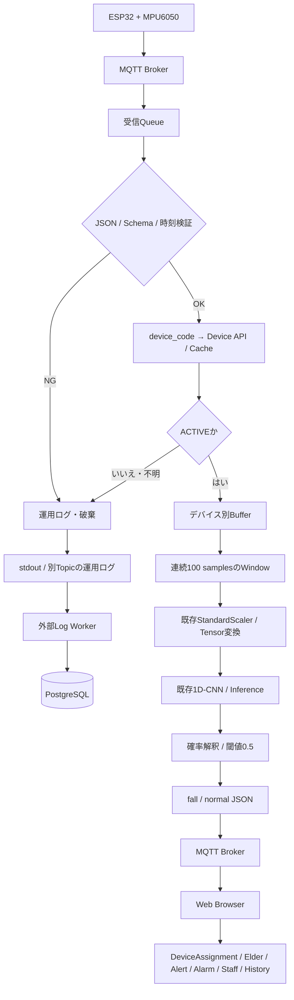

# 01 AI Server 詳細設計

作成日: 2026-10-06 ／ 状態: レビュー用（外部契約・モデル実物の確認待ち）

## 1. 目的・設計根拠

ESP32 + MPU6050のセンサーデータから、完成済みのPyTorch 1D-CNNと対応するStandardScalerを使い、Normal / FallをMQTT配信する。モデル開発ではなく、約1ヶ月で実装・結合・試験できる推論パイプラインを設計する。

依頼文の末尾の「基本設計全文」はプレースホルダーのままであり、AI専用基本設計本文は未提供。本書は依頼文に明記された仕様を優先し、リポジトリの[全体基本設計](../../basic_design/overview.md)、[MQTT Broker設計](../../basic_design/mqtt-broker.md)、[Web基本設計](../../basic_design/web_basic.md)を補助資料とする。基本設計全文との完全な照合は未実施である。

確認時点では`main/ai/features/inference/`は説明文字列中心の雛形で、モデル・Scaler実ファイル、モデルクラス、学習時の推論コードは見つからない。以下は実装済み機能の説明ではなく詳細設計である。

| 表記 | 意味 |
|---|---|
| 確定前提 | 依頼文が指定した要件 |
| 設計方針 | 本書で提案する内部実装の方針 |
| `[TBD]`（推奨: …） | 未合意の外部仕様・運用値。推奨値は確定値ではない |
| 確認事項 | 既存資料の差異・実物との照合が必要 |

## 2. AI Serverの責務

対象はMQTT接続・購読、JSON検証、device_code識別、Web APIによるDevice確認、デバイス別バッファ、Window生成、既存Scaler変換、既存モデル読込・推論、閾値0.5判定、結果Publish、再接続、例外処理、AI運用ログである。

対象外はモデル学習・再学習、Dataset作成、構造設計、Hyperparameter調整、精度改善、Elder管理、Alert管理・DB保存、Alarm制御、Staff対応管理、PostgreSQL直接接続。運用ログのDB保存も外部Log Workerの責務とする。

実運用対象はセンサーデバイス1台、AI Server 1プロセス・1インスタンス。デバイスキーを持つ構造で将来の複数台を可能にするが、分散キュー、共有キャッシュ、クラスタ、モデル自動更新は導入しない。EC2の台数は別概念で、既存資料のEC2 #1／#2配置を参考とする。

## 3. 内部構成・実行方式

```text
FastAPI（lifespan・healthのみ）
 ├─ MQTT Client（ネットワークスレッド1本）
 ├─ bounded受信Queue → Pipeline Worker（1本）
 │   ├─ Schema Validation / Device Manager
 │   ├─ Buffer Manager
 │   ├─ Preprocessor
 │   ├─ Inference Engine
 │   └─ Result Publisher
 └─ Python logging → stdout / 運用ログMQTT
```

MQTT callbackでHTTP呼出し・推論・送達待機をしない。callbackは受信サイズを検査し、payload・topic・retain・受信UTC・monotonic時刻・接続世代を`queue.Queue`へ非ブロッキング投入する。単一WorkerがJSON検証以降とデバイス状態・Bufferを所有し、順序とスレッド安全性を単純化する。推論はHTTPイベントループ外で実施する。

受信Queue上限は設計値500メッセージ（50Hzで10秒相当）とし、実際には03の鮮度制限で古いデータを捨てる。満杯時は新着を捨て、データ欠落フラグを立てる。Workerはフラグを見て全Queue・Bufferをクリアし、新しい連続区間から再開する。欠落を跨いでWindowを作らない。制御通知は満杯になるデータQueueとは別のEvent／ロック付き状態で渡す。

FastAPIは1 workerで起動する。複数Uvicorn workerや本番auto-reloadはMQTTの二重購読・二重推論を起こすため使わない。モデル・Scalerは起動時に各1回ロードし、読取専用で使う。

## 4. Module Responsibility

| Module | Responsibility | Input | Output | Dependency |
|---|---|---|---|---|
| `main.py` | lifespan、開始・停止、health、Worker監視 | 起動・終了要求 | HTTP health、実行状態 | 全モジュール |
| `config.py` | 環境変数検証、固定ポリシー | env、対応表 | 検証済み設定 | 標準ライブラリ |
| `schemas.py` | JSON・時刻・6軸・結果の検証 | payload、内部結果 | SensorSample / Result | Pydantic等 |
| `mqtt_client.py` | TLS、subscribe、再接続、Publish完了管理 | Broker設定、送信要求 | 受信Queue、接続状態 | paho-mqtt |
| `pipeline.py` | 処理順序、エラー境界、OFFLINE掃除 | 受信Envelope | 推論・送信要求 | 下記モジュール |
| `device.py` | API参照、最小キャッシュ、稼働可否 | device_code | ACTIVE / INACTIVE / UNKNOWN | HTTPS client |
| `buffer.py` | デバイス別連続区間・Window | SensorSample | immutable WindowまたはNone | deque、NumPy |
| `preprocessing.py` | 既存Scaler読込・transform・整形 | Window (100,6) | モデル用Tensor | scikit-learn、NumPy、PyTorch |
| `inference.py` | 既存モデル読込、出力解釈、閾値 | Tensor | p_fall、fall / normal | PyTorch、既存model class |
| `result.py` | 結果生成、送信要求 | 判定・device・window時刻 | JSON | schemas、mqtt_client |
| `logging_setup.py` | 構造化ログ、必要イベント転送 | event・安全な属性 | stdout、ログMQTT | Python logging |

Log Manager専用サービスや各モジュールの多層Repositoryは作らない。関数と必要最小限の状態クラスで実装する。

## 5. 起動・停止・Ready

1. `SERVER_START`をstdoutに出し、envと実行ポリシーを検証する。
2. 信頼済み`best_1dcnn_pytorch.pth`をロードする。続いて対応Scalerをロードする。
3. モデル・Scaler・Feature順・単位・Window・dtype・出力解釈・versionを04の手順で検証し、`model.eval()`、推論モードで既知入力のsmoke testを実施する。
4. Queue・Worker・Device HTTP clientを開始し、MQTTへ接続する。
5. CONNACK成功後にSubscribeし、SUBACK成功を確認する。
6. モデル検証済み、Worker稼働、MQTT接続・購読済みの全条件で`READY`へ移行し、`SERVER_READY`を記録する。

モデル／Scaler／設定失敗は起動失敗・非ゼロ終了。MQTT一時障害は`CONNECTING`のまま再試行でき、Readyにしない。`GET /health/live`はプロセスとWorkerの生存（起動準備中を除く）を、`GET /health/ready`は上記条件を200/503で返す。Device API障害時は`DEGRADED`としてreadyを503とし、有効なキャッシュのデバイスのみ継続可能とする。未知／無効Deviceからの単発受信だけではサーバー全体を非Readyにしない。

Device APIの一時障害フラグは、cooldown後の実要求が正常な200または契約通りの404を返した時点で解除する。他のReady条件も成立すればREADYへ復帰する。新規受信がなくAPIを再確認できない間は非Readyを維持する。401/403等で再要求を抑止した場合は設定修正・再起動で復旧する。readinessの503を理由にプロセスを自動再起動せず、livenessと区別する。

MQTT切断時は即座に非Readyにし、世代を更新する。旧世代Queue・Bufferを破棄し、再接続・SUBACK後に再び100点を蓄積する。Worker異常終了はlive/readyを503とし、プロセスを終了させ運用側の再起動に委ねる。

停止時は非Ready化→新着受付停止→Worker終了要求→結果送信完了を最大5秒待機→MQTT disconnect / loop停止→HTTP client close。未送達数をstdoutに残す。待機時間は内部設計値で、永続復旧は保証しない。

## 6. データ全体フロー



## 7. 文書案内

- [02 MQTT・Device](02_MQTT・Device詳細設計.md): 通信・メッセージ・Device API契約。
- [03 Buffer・Window・Preprocessing](03_Buffer・Window・Preprocessing詳細設計.md): 時系列・欠測・Scaler。
- [04 Model Integration・Inference](04_Model_Integration・Inference詳細設計.md): 既存成果物の検証と推論。
- [05 Result・Web連携](05_Result・Web連携詳細設計.md): 送達・重複・責務分離。
- [06 Error・Log・Config](06_Error・Log・Config詳細設計.md): エラー、設定、試験、計画、整合表、TBD、Checklist、Python構成。
