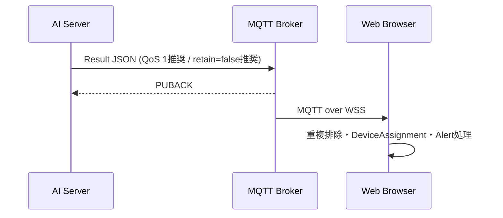

# 05 Result・Web連携 詳細設計

## 1. 結果メッセージ

各成功Windowについてfallまたはnormalを1件生成する。複数Windowの連続fallをAI側でAlertに集約しない。

```json
{
  "device_code": "ESP32-001",
  "result": "fall",
  "detected_at": "2026-09-23T10:00:05.000Z",
  "model_version": "prototype-phase-1"
}
```

| Field | Type | Required | Validation / 意味 |
|---|---|---|---|
| device_code | string | Yes | 検証済みWindowの識別子と完全一致 |
| result | string | Yes | `fall` / `normal`のみ。エラーをnormalとして出さない |
| detected_at | string | Yes | timezone付きUTC ISO 8601、ミリ秒精度推奨。意味は下記 `[TBD]` |
| model_version | string | Yes | 起動時検証した成果物組のversion。例の文字列を固定採用しない |

Timestampは`[TBD]`。推奨はdetected_atを「判定に使用したWindow終端のmeasured_at」とし、推論完了時刻・Publish時刻は運用ログに分ける。この値は転倒が起きた瞬間を推定した時刻ではない。Webが処理完了時刻を要求する場合は契約を変更し、Window識別子を別途合意する。再送時にdetected_atを書き換えない。

## 2. Publishと送達



Topic・QoS・Retainの確定は02および06のTBDに従う。AI→Web APIへのAlert POSTは実装しない。Device参照用GETと結果通知経路を混同しない。

結果の内部状態は`CREATED → ACCEPTED_BY_CLIENT → ACKED`、受付拒否は`FAILED`、送達待機期限超過は`DELIVERY_UNKNOWN`とする。QoS 1ではBrokerへの受付確認までで、ブラウザの受信・Alert保存・スタッフ確認は保証しない。

送信管理は次の内部設計とする。

- Pahoの送信キューを有限（結果とログを合わせ100件）、inflightを有限（10件）にし、別の無制限再送Queueを作らない。ログ転送は送信余裕がある場合のみ行う。
- `publish()`の戻り値が成功なら同じpayloadをアプリ側で再Publishしない。QoS 1の未ACK再送はclientに任せる。
- 即時失敗した場合も同じWindowを無条件に再送しない。切断後の処理方針に従い、失敗件数を残す。
- ACK待ちは推奨5秒 `[TBD]`。timeoutは未送達確定ではなく送達不明で、失敗ログを出して新規Publishで重複を増やさない。
- callbackと送信処理の競合を避け、`MQTTMessageInfo`の完了状態で追跡する。MIDは接続・プロセスを跨ぐ業務Event IDに使わない。

現在の1ヶ月案は「短期のclient内再送のみ、永続outboxなし」。プロセス終了・クラッシュでは未送達結果を失い得る。切断中にACK済み結果を再送する機能もない。clientが再接続時に遅延した未ACK結果を送る可能性があるため、Webは時刻・重複・古いイベントの扱いを実装する。通知損失ゼロやexactly-onceは保証しない。この配信条件を結合前に合意する。

## 3. Event ID・重複・古い結果

Event IDは`[TBD]`で基本payloadには未追加。推奨は`event_id`を追加し、Window結果生成時に一度だけUUIDを採番、同じ結果の再送で保持する方式。新規Windowのfallは別event_idであり、同じ転倒の二重Alert抑制はWebの別ルールで扱う。

追加を見送る場合は`(device_code, detected_at, model_version)`を暫定重複キーとする案。ただしdetected_atがWindow終端時刻、デバイス時刻が一意という合意が必要で、再起動・時計巻戻りを跨ぐ完全な一意性はない。基本4項目だけで厳密な重複排除を保証しない。

Webの結果鮮度上限と重複キー保持期間も`[TBD]`。推奨例は古さ10秒超を即時Alarm対象外として表示上区別し、重複キーを10分保持すること。ただし実運用での通知損失とのトレードオフをWeb担当と合意する。再接続・再読込時の動作も含めて試験する。

## 4. 責務分離

| 処理 | AI Server | Web / 外部コンポーネント |
|---|---|---|
| Sensor validation / Window / Inference | 実施 | 実施しない |
| Device識別・利用可否確認 | codeとAPIで実施 | Device情報の正本を提供 |
| Elder特定 | 保持・取得しない | DeviceAssignmentで特定 |
| 判定通知 | MQTT Publish | WSS購読、重複・鮮度確認 |
| Alert / Alarm | 管理しない | Webの責務 |
| Staff Action / History | 管理しない | Webの責務。保存対象は別途合意 |
| AI Operation Log | 生成、stdout、別Topicへ転送 | Log WorkerがDB保存 |
| PostgreSQL | 直接接続しない | Web / Log Workerからアクセス |

normal受信を「スタッフ対応済み」や「既存Alert自動解除」の指示として扱わない。DeviceAssignment変更と遅延結果の競合では、検知時点／受信時点どちらの割当を参照するかをWeb側で合意する。AIはElder IDを付与しない。

既存Web設計はHistoryをスタッフ投稿として扱い、AI結果の自動履歴保存を前提としない。一方Broker設計はFallLog保存に言及する。この差異は確認事項であり、今回AI側にAlert POSTやDB保存を追加して解消しない。

## 5. Web結合条件

1. Device APIのcode・status・認証・HTTPS契約を確定する。
2. IoT入力、Result Topic、schema、Timestamp、QoS、Retain、重複方式を全担当で一致させる。
3. ブラウザにWSS用の認証・必要Topicだけのsubscribe権限を与える。AIやDevice用secretを配布しない。
4. normal/fall、0.5境界、複数Windowのfall、二重配信、古いretained結果、切断・復帰を確認する。
5. 正常な接続条件で推論完了からダッシュボード表示まで1秒以内という既存Web目標を測定する。端末計測→Window完成の約2秒は別区間。サーバー／ブラウザ時刻同期と測定条件を記録する。
6. Deviceが未割当・無効・API不明のケースで誤ったElderへAlertを関連付けないことをWeb側で確認する。
