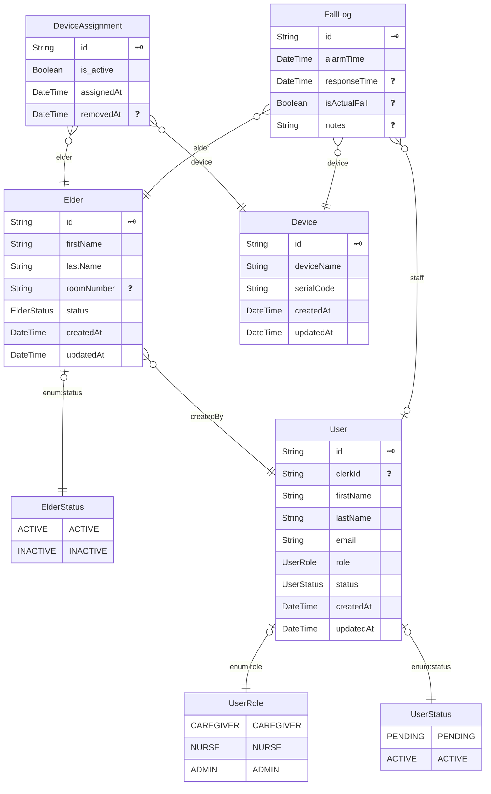

```mermaid
erDiagram

        UserRole {
            CAREGIVER CAREGIVER
NURSE NURSE
ADMIN ADMIN
        }
    


        UserStatus {
            PENDING PENDING
ACTIVE ACTIVE
        }
    


        ElderStatus {
            ACTIVE ACTIVE
INACTIVE INACTIVE
        }
    
  "User" {
    String id "🗝️"
    String clerkId "❓"
    String firstName 
    String lastName 
    String email 
    UserRole role 
    UserStatus status 
    DateTime createdAt 
    DateTime updatedAt 
    }
  

  "Elder" {
    String id "🗝️"
    String firstName 
    String lastName 
    String roomNumber "❓"
    ElderStatus status 
    DateTime createdAt 
    DateTime updatedAt 
    }
  

  "Device" {
    String id "🗝️"
    String deviceName 
    String serialCode 
    DateTime createdAt 
    DateTime updatedAt 
    }
  

  "DeviceAssignment" {
    String id "🗝️"
    Boolean is_active 
    DateTime assignedAt 
    DateTime removedAt "❓"
    }
  

  "FallLog" {
    String id "🗝️"
    DateTime alarmTime 
    DateTime responseTime "❓"
    Boolean isActualFall "❓"
    String notes "❓"
    }
  
    "User" |o--|| "UserRole" : "enum:role"
    "User" |o--|| "UserStatus" : "enum:status"
    "Elder" |o--|| "ElderStatus" : "enum:status"
    "Elder" }o--|| "User" : "createdBy"
    "DeviceAssignment" }o--|| "Elder" : "elder"
    "DeviceAssignment" }o--|| "Device" : "device"
    "FallLog" }o--|| "Elder" : "elder"
    "FallLog" }o--|| "Device" : "device"
    "FallLog" }o--|o "User" : "staff"
```
