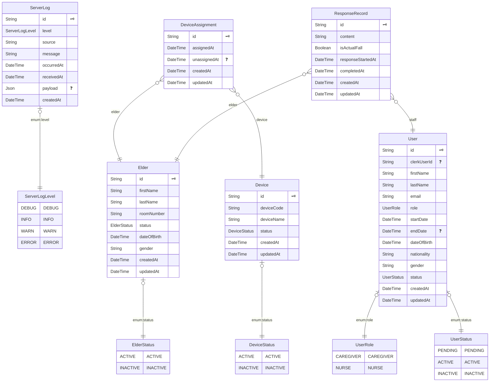

```mermaid
erDiagram

        UserRole {
            CAREGIVER CAREGIVER
NURSE NURSE
        }
    


        UserStatus {
            PENDING PENDING
ACTIVE ACTIVE
INACTIVE INACTIVE
        }
    


        ElderStatus {
            ACTIVE ACTIVE
INACTIVE INACTIVE
        }
    


        DeviceStatus {
            ACTIVE ACTIVE
INACTIVE INACTIVE
        }
    


        ServerLogLevel {
            DEBUG DEBUG
INFO INFO
WARN WARN
ERROR ERROR
        }
    
  "User" {
    String id "🗝️"
    String clerkUserId "❓"
    String firstName 
    String lastName 
    String email 
    UserRole role 
    DateTime startDate 
    DateTime endDate "❓"
    DateTime dateOfBirth 
    String nationality 
    String gender 
    UserStatus status 
    DateTime createdAt 
    DateTime updatedAt 
    }
  

  "Elder" {
    String id "🗝️"
    String firstName 
    String lastName 
    String roomNumber 
    ElderStatus status 
    DateTime dateOfBirth 
    String gender 
    DateTime createdAt 
    DateTime updatedAt 
    }
  

  "Device" {
    String id "🗝️"
    String deviceCode 
    String deviceName 
    DeviceStatus status 
    DateTime createdAt 
    DateTime updatedAt 
    }
  

  "DeviceAssignment" {
    String id "🗝️"
    DateTime assignedAt 
    DateTime unassignedAt "❓"
    DateTime createdAt 
    DateTime updatedAt 
    }
  

  "ResponseRecord" {
    String id "🗝️"
    String content 
    Boolean isActualFall 
    DateTime responseStartedAt 
    DateTime completedAt 
    DateTime createdAt 
    DateTime updatedAt 
    }
  

  "ServerLog" {
    String id "🗝️"
    ServerLogLevel level 
    String source 
    String message 
    DateTime occurredAt 
    DateTime receivedAt 
    Json payload "❓"
    DateTime createdAt 
    }
  
    "User" |o--|| "UserRole" : "enum:role"
    "User" |o--|| "UserStatus" : "enum:status"
    "Elder" |o--|| "ElderStatus" : "enum:status"
    "Device" |o--|| "DeviceStatus" : "enum:status"
    "DeviceAssignment" }o--|| "Elder" : "elder"
    "DeviceAssignment" }o--|| "Device" : "device"
    "ResponseRecord" }o--|| "Elder" : "elder"
    "ResponseRecord" }o--|| "User" : "staff"
    "ServerLog" |o--|| "ServerLogLevel" : "enum:level"
```
